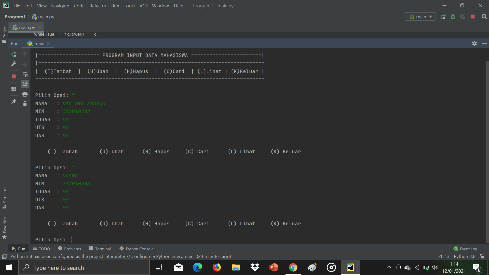
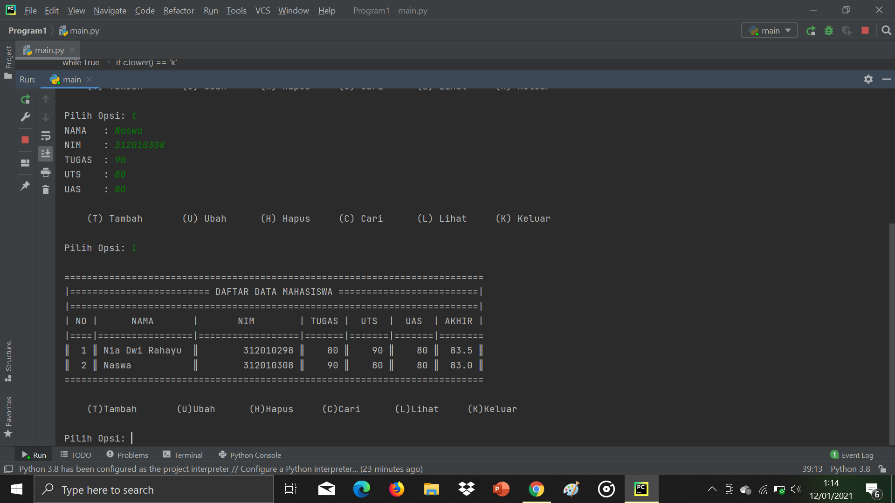
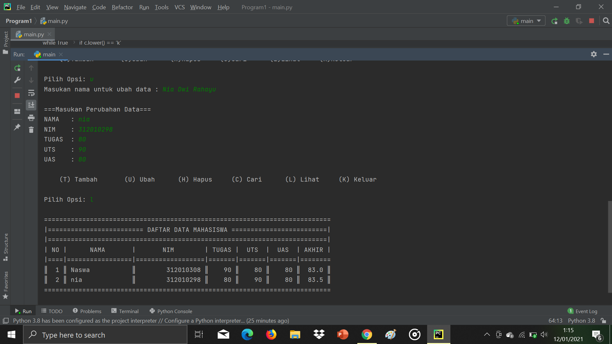
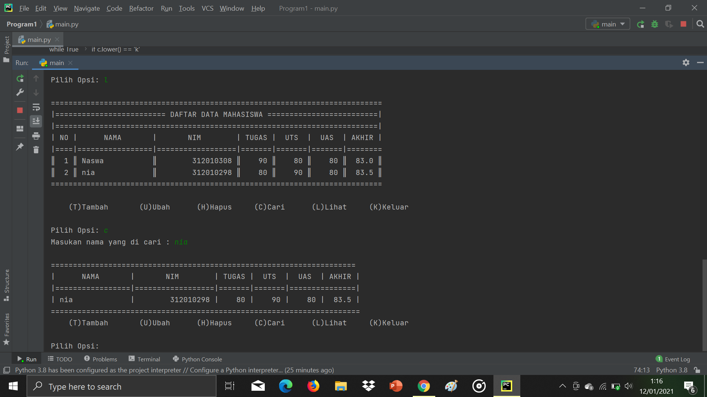
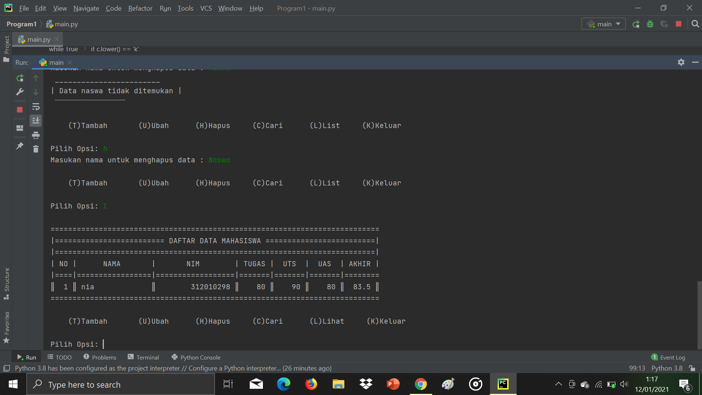
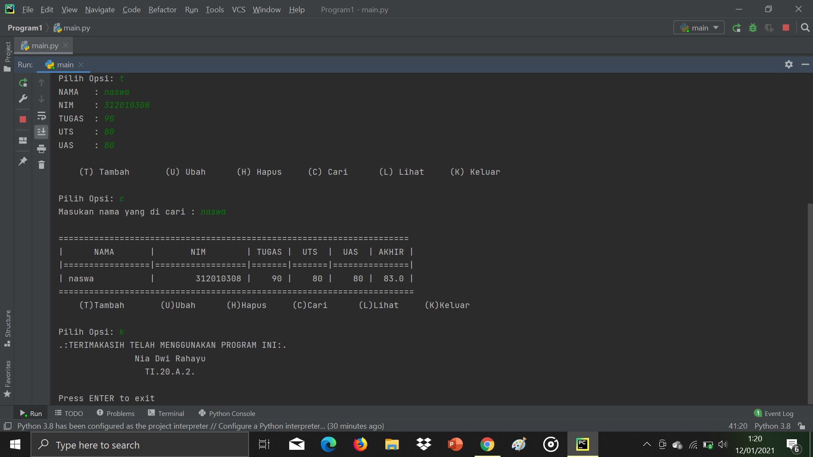

Tugas UAS

# UAS 2021
# PACKAGE & MODULE

* ``daftar_nilai.py`` berisi modul untuk  :
    * tambah_data
    * ubah_data
    * hapus_data
    * cari_data 
* ``view_nilai.py`` berisi modul untuk : 
    * cetak_daftar_nilai 
    * cetak_hasil_pencarian
* ``input_nilai.py`` berisi modul untuk :
    * input_data (yang meminta pengguna memasukkan data).
* ``main.py`` berisi program utama (menu pilihan yang memanggil semua menu yang ada).
* **Output tambah_data**

  

* **Output daftar_nilai**

* **Output ubah_data**

* **Output Cari_data**

* **Output Hapus_data**

* **Output break**

